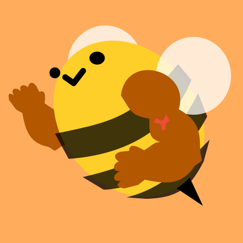

# Beebee

I'm Beebee, a bracket bot. Use me to make brackets where everyone can fight each round, balanced by win-loss ratios.

If you're a Beebee bot owner and concerned about it being abused because of the public nature of its commands, please consider the `black_list` and `white_list` options in `index.js`. Happy fighting.

*If you're looking for a standard 2-loss - you're out, hierarchical-progression bracket, this is not your bot. There are many existing tools for those.*

## Usage

There are many commands at your disposal. For example:

`!bracket smash_ult -join xx-l33t_g4m3r_t4g-xx`

`!bracket nick_brawl -seed pure_rng`

Please note all text given to this bot will be converted to lowercase, and it does not accept spaces or periods for handle names nor bracket names. This is intended to make the bot case-insensitive and auto-correct friendly, but if it's a real hindrance, your bot owner can easily change this behavior.

Be mindful, for example, just deleting a space: `Dragon Slayer` => `DragonSlayer` => `dragonslayer`. It'd probably be better to go with `dragon_slayer`.

You can request more and report issues in the Issues tab.

### -create

`!bracket my_bracket -create handle`

Create a bracket. It will be empty except for `$handle`.

### -delete

Ask bot owner.

This command is intentionally unimplemented so no average user can accidentally or spitefully delete a bracket.

### -display

`!bracket my_bracket -display`

Display all the information of `$my_bracket`.

### -modify

Ask bot owner.

This command is intentionally unimplemented so no average user can accidentally or spitefully modify a bracket.

### -join

`!bracket my_bracket -join handle`

Add `$handle` to the list of participants of `my_bracket`. It is implemented this way, instead of a user only being able to sign themself up, so no participants *need* a Discord account to sign up (someone else can do it on their behalf).

### -leave

Ask bot owner.

This command is intentionally unimplemented so no average user can accidentally or spitefully kick a user from a bracket. You may pause a `$handle` if they intend to leave temporarily.

### -pause

`!bracket my_bracket -pause handle`

Indicate `$handle` as inactive for future seeds of `$my_bracket`, so they will be left out. Great if someone can't participate just this week, or something similar. Undo with unpause.

### -unpause

`!bracket my_bracket -unpause handle`

Indicate `$handle` as active for future seeds of `$my_bracket`, so they will be included in seeds again if they were paused. Created to be able to undo pause.

### -seed

`!bracket my_bracket -seed [no_rng, some_rng, pure_rng]`

Find a combatant for each participant of `$bracket`. 

- `no_rng` Matches each participant with another participant of the closest winrate. Rerunning the command with no participant changes gives the same result.
- `some_rng` Matches each participant with another participant of *similar* winrates. You might get some surprising matchups with participants across winrates who don't usually play with eachother in `no_rng`. Rerunning the command gives slightly different results each time.
- `pure_rng` Matches each participant with another random participant, regardless of winrate. Rerunning the command (usually) gives very different results each time.

Once the participants settle on a bracket they like, they can decide to abide by one. But because people are people (hard to coordinate and schedule), participants are not barred to only be able to tally wins and losses against their opponent the bot decided. They can still fight, win against, and lose to anyone. The bot does not store brackets, just gives you and your group ideas.

### -win

`!bracket my_bracket -win handle`

Record another win for `$handle`. Winrates are used for balacing brackets and bragging rights.

### -lose

`!bracket my_bracket -lose handle`

Record another loss for `$handle`. Winrates are used for balacing brackets and bragging rights.
